# CodeBook

## About

This is project done in SE fro Python language by : Tejas Ghone,Vatsal Soni, Yashodhan Joshi , Yatharth Vyas

## About Project

Transform your Ideas into lines of Code
At CodeBook, our primary goal is to connect like-minded coders and
provide a platform for them to share their challenges, come up with
solutions for user submitted problems and compile any code.

## Features

<h4>Follow other Coders</h4>
Follow other users to get notified of their posts! Share your
questions with one another and keep Coding!

Developers can connect with each other, work on solving problems
and learn all at the same time!

<h4>Create new Challenges</h4>
Come up with new ideas and post them here! You can share all sorts
of problems related to programming by simply registering with us and
submitting your challenges here!

Describe your problem statement, give it an eye catching title and
submit your solution. With these simple steps, any developer can
post their challenges

<h4>Post your Challenges to share with the world!</h4>

Once you post your challenge, every user registered with us can try
to crack the logic behind it. Learn to code with fun!

You can also choose to share your challenge with your friends or to
the entire website.

## Technologies Used:

<table style="width: 100%;" >
	<tbody>
		<tr style="height: 21px;">
			<td style="width: 28.8348%; height: 21px;">&nbsp;Backend</td>
			<td style="width: 70.1652%; height: 21px;">&nbsp;Flask</td>
		</tr>
		<tr style="height: 20.6667px;">
			<td style="width: 28.8348%; height: 20.6667px;">&nbsp;Frontend</td>
			<td style="width: 70.1652%; height: 20.6667px;">&nbsp;HTML,CSS,Javascript and Jinga</td>
		</tr>
		<tr style="height: 20px;">
			<td style="width: 28.8348%; height: 20px;">&nbsp;Database&nbsp;</td>
			<td style="width: 70.1652%; height: 20px;">&nbsp;MongoDB</td>
		</tr>
		<tr style="height: 21px;">
			<td style="width: 28.8348%; height: 21px;">&nbsp;Authnetication</td>
			<td style="width: 70.1652%; height: 21px;">&nbsp;JWT</td>
		</tr>
	</tbody>
</table>
<!-- DivTable.com -->

## Glimpse of our CodeBook:

#### Main Page

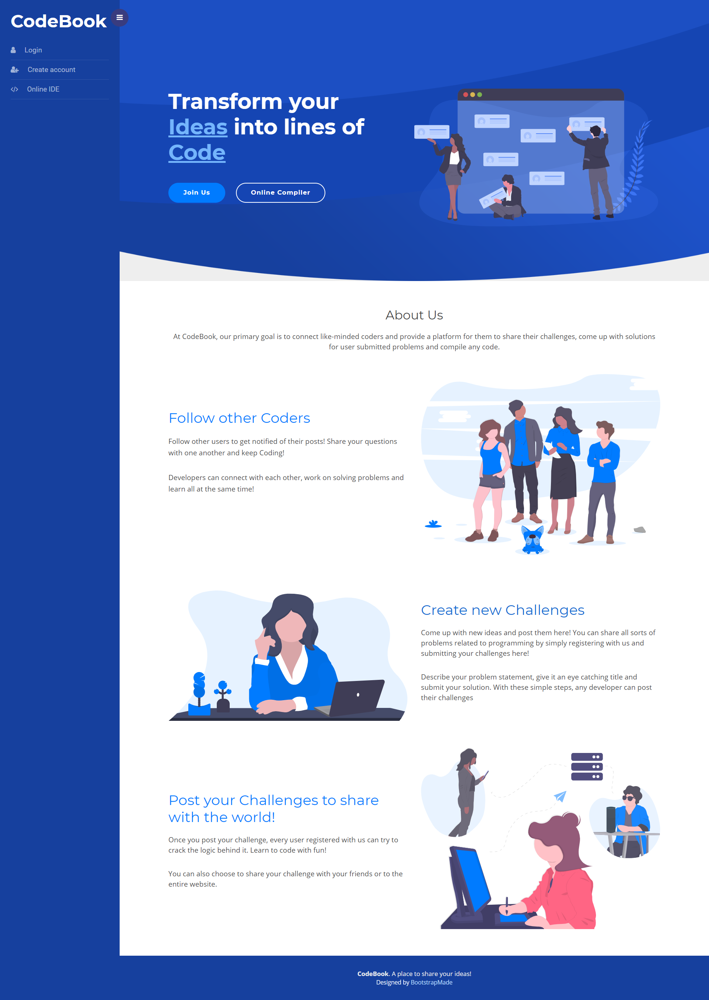

#### Login

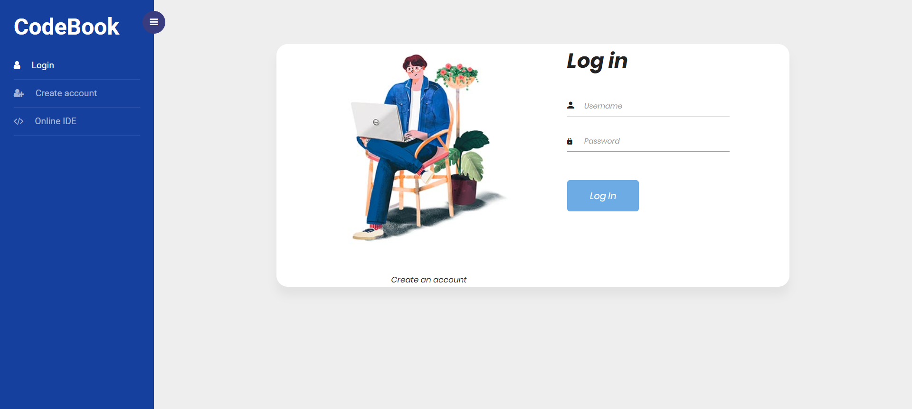

#### SignUp

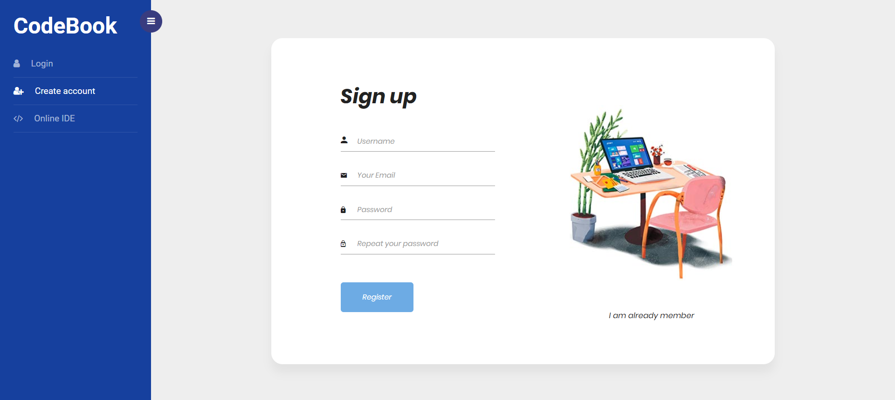

#### Home

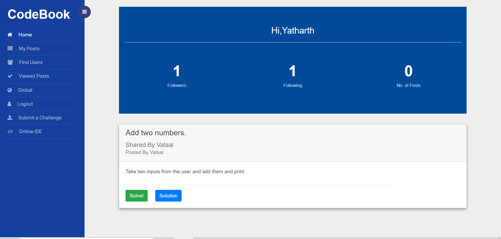

#### MyPost

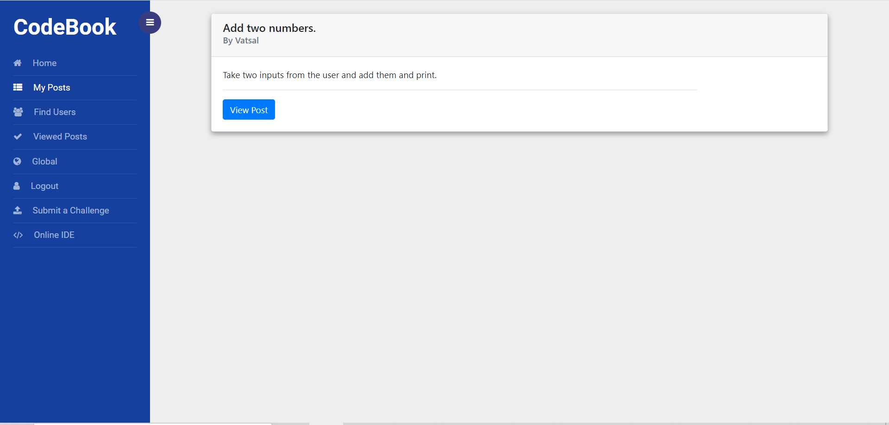

#### Solving Challenge

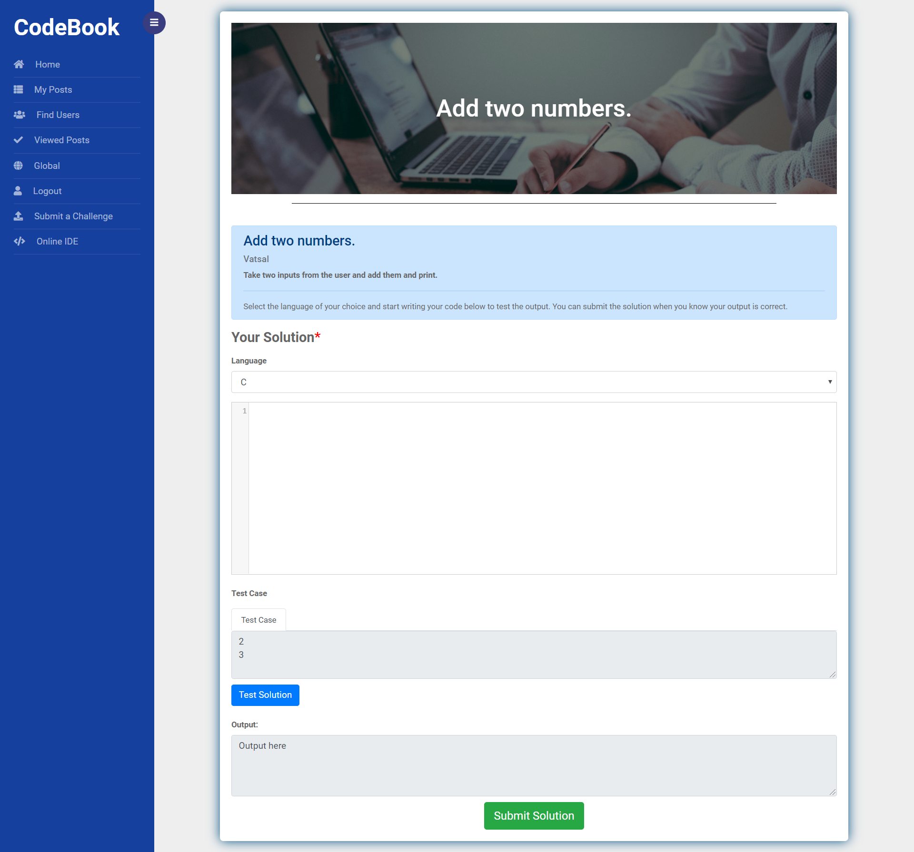

#### View Solution

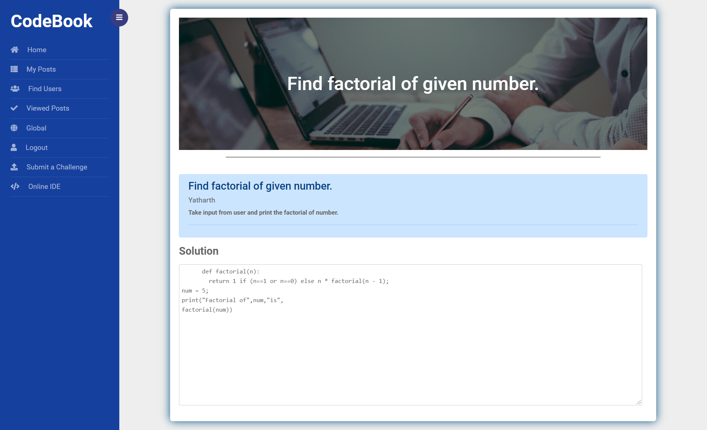

#### FindUser

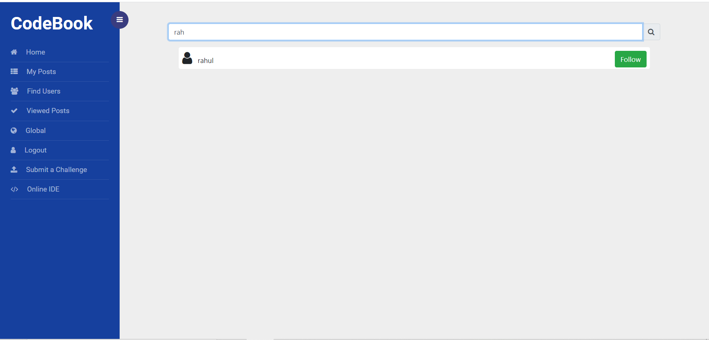

#### PostChallenge

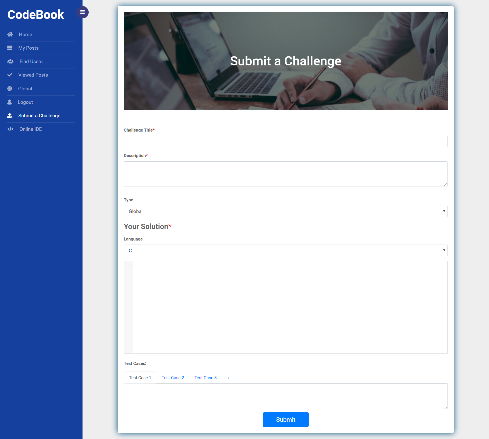

#### Online IDE

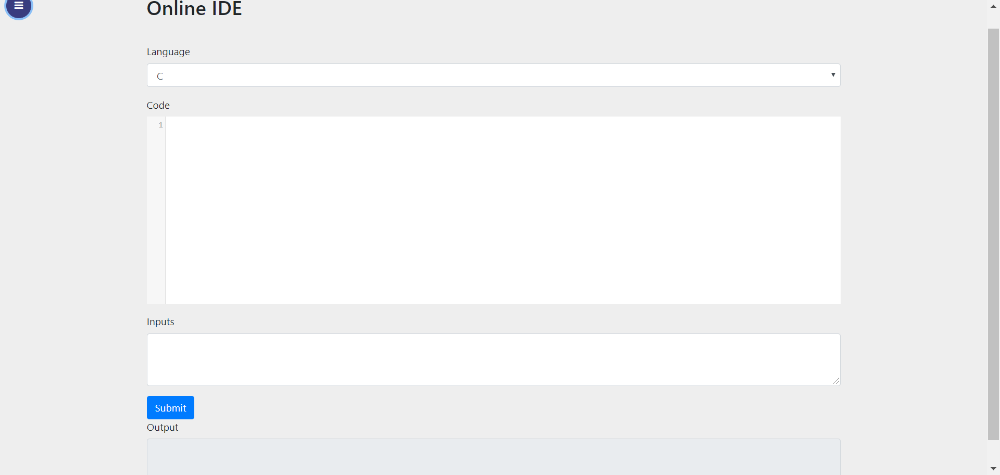

#### Mobile View(Responsive)

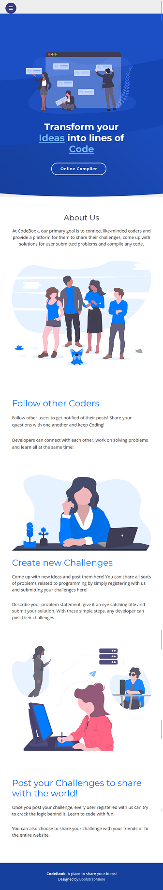
